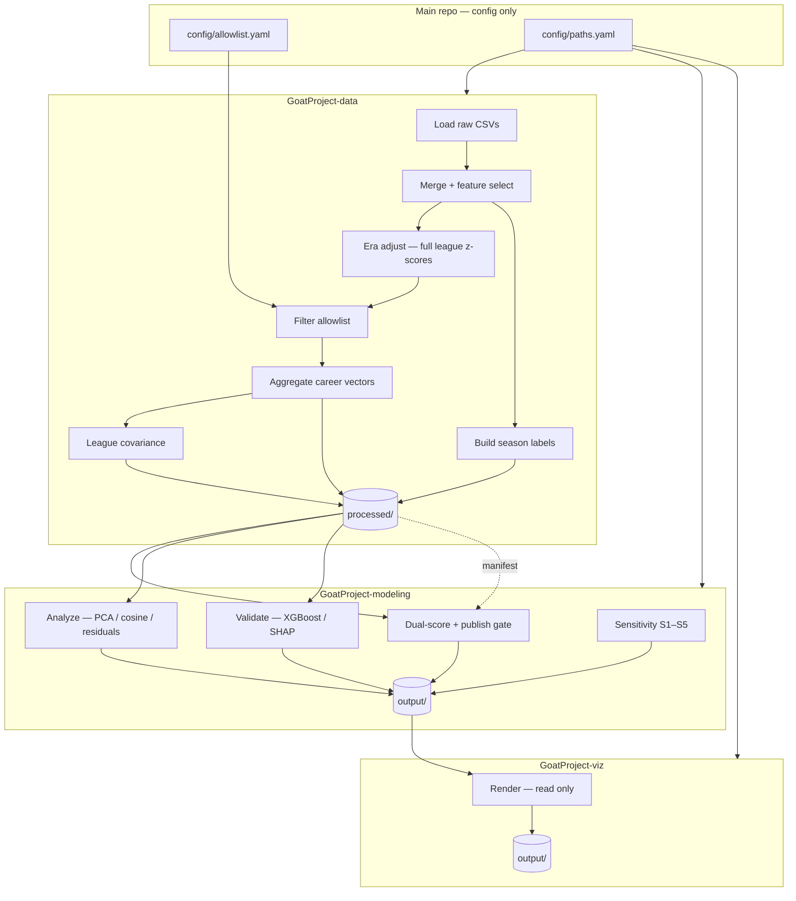

# NBA GOAT Ranking System — Architecture (v2)

**Status:** Approved — canonical spec  
**Version:** 2.0.0  
**Approved:** 2026-06-14 (v1); **v2 reconciled:** 2026-06-21  
**Player pool:** **100** curated allowlist (`default_viz_players`: 21 for 3D picker default)

**Memory index:** `MEMORY/MEMORY.md`  
**Build plan:** `plans/goat-nba-ranking-system.md`  
**Formulas:** `MATHS.md`  
**Configuration:** `config/allowlist.yaml` · `config/paths.yaml` · `config/features.yaml` · `config/scoring.yaml` · `config/playoffs.yaml` · `config/labels.yaml` · `config/pipeline.yaml` · `config/viz.yaml`

This document is the **single source of truth** for system design. Config YAML files implement parameters defined here; they do not override this spec.

### Version history

| Version | Date | Summary |
|---------|------|---------|
| 1.0.0 | 2026-06-14 | 21-player stat-space index; playoffs deferred; dual-score publish gate |
| 2.0.0 | 2026-06-21 | Pool expanded to **100**; playoff/championship layer + `score_goat_index`; interactive 3D viz; pipeline Steps 1–5 shipped. Publish gate **failed** at 100-player scale (Spearman 0.826, top-5 overlap 1) — see §8.2. |

---

## 1. Purpose and scope

### Epistemic status

The NBA GOAT Ranking System produces a **100-player stat-space index** — a reproducible composite over a curated shortlist of all-time candidates, with optional team-title and clutch/consensus adjustments. It is **not** a claim of objective all-time GOAT truth or league-wide optimality.

| Claim | Allowed | Forbidden |
|-------|---------|-----------|
| "Composite index over 100 curated players using era-adjusted advanced stats" | ✅ | |
| "L2 / Mahalanobis norm of oriented career vector in z-scored feature space" | ✅ | |
| "Team-weighted title credit and clutch/consensus adjustment (`score_goat_index`)" | ✅ | |
| "Objective GOAT ranking" / "definitive all-time #1" | | ❌ |
| "League-wide ranking of all NBA players" | | ❌ |

**Public framing** (from `config/scoring.yaml` → `public_framing`):

- **Index name:** 100-player GOAT stat-space index
- **Required disclaimer:** Curated 100-player composite index with team-weighted titles and clutch/consensus adjustment. Career index = unweighted mean of era-adjusted seasons (mp ≥ 200), not peak-only.

Every published artifact (HTML, PNG captions, README) must carry the disclaimer. Visualization layout views (PCA scatter, similarity heatmaps) are **exploratory** and must not be presented as the headline rank unless explicitly labeled otherwise (see §9).

### Construct validity

PER, BPM, VORP, and WS measure overlapping latent "overall impact." L2 treats correlated z-features as independent dimensions; Mahalanobis and PCA-whitened L2 answer different geometric questions under the same vector. The index is a **transparent composite**, not a peak-vs-longevity adjudication or causal greatness measure. Sensitivity runs S1–S5 (§7.7) and the publish gate (§8.2) document stability before any public headline.

### In scope (v2)

- Rank **100 curated all-time players** using era-adjusted statistical embeddings.
- **Geometry scores:** L2, Mahalanobis, and PCA-whitened L2; **public geometry headline** chosen by publish gate (§8.2).
- **Composite index:** `score_goat_index` — PCA-whitened distance minus weighted title credit plus clutch/consensus penalty (`config/playoffs.yaml`; `MATHS.md` §8–9).
- **Playoff context:** Finals results + team-season strength PCA → ring credit, depth scores, repeat-title bonuses (no player-level playoff stat rows).
- **Exploration:** PCA (2D + interactive 3D), cosine similarity, projection residuals, impact crown among visible subset.
- **Validation:** XGBoost + SHAP vs MVP vote share and All-NBA labels (sanity check only; §8.3).
- **Presentation:** Static PNGs, `index.html`, interactive `embed_3d.html` with 21-player default picker (see §9).

### Out of scope

- League-wide ranking or dynamic pool expansion beyond the allowlist.
- Live data feeds, APIs, or web app deployment.
- Replacing index rank with supervised model output.
- `Per 100 Poss.csv` feature joins (deferred; schema reserved in `features.yaml`).

---

## 2. System map



**Rule:** Dependencies flow downward only. Viz never reads raw CSVs. Modeling never re-z-scores. Only the data layer writes `processed/`.

**Primary rank:** Evidence-gated headline score (`score_l2` or `score_mahalanobis` per publish gate). XGBoost and PCA distances are **never** the public headline rank.

---

## 3. Component responsibilities

Each component must pass the one-sentence test (no "and" joining unrelated jobs).

| Component | Worktree | Owns | Must not |
|-----------|----------|------|----------|
| **Allowlist config** | main | Who is in the 100-player pool (+ default 21 for viz) | Resolve IDs, transform stats |
| **Loader** | data | Read Kaggle CSVs into typed frames | Z-score, rank, plot |
| **Merger** | data | Join on `(player_id, season)`; select features | Filter allowlist before z-score |
| **Era adjuster** | data | Z-score by `(season, position)` on **full league** | Use allowlist-only baselines |
| **Aggregator** | data | Career vector = mean of season vectors | Train ML models |
| **Label builder** | data | `season_labels.parquet` from award CSVs | Predict or rank |
| **Covariance builder** | data | `league_career_covariance.npy` + manifest stats | Score or rank |
| **Pipeline orchestrator** | data | Run stages; write `manifest.json` | Contain business logic inline |
| **Ranker** | modeling | `goat_rankings.csv`; dual scores + publish gate | Read raw CSVs; overwrite manifest |
| **Analyzer** | modeling | PCA, similarity, uniqueness artifacts + `pca_explained_variance.json` | Change canonical rank |
| **Validator** | modeling | Season-level sanity metrics per §8.3; SHAP diagnostics | Overwrite primary rank or publish gate |
| **Sensitivity runner** | modeling | `sensitivity_report.json` (S1–S5) | Block publish without recording results |
| **Renderer** | viz | HTML, PNG posts, charts from artifacts only | Process data; read raw CSVs |

---

## 4. State ownership

| State | Writer | Readers | Mutable by others? |
|-------|--------|---------|-------------------|
| Raw CSVs | external (Kaggle) | data Loader | No |
| `config/*.yaml` | human / main branch | all worktrees (read) | No |
| `processed/*` | data pipeline | modeling, viz (read-only) | No |
| `manifest.json` | data pipeline | all downstream | No |
| `output/goat_rankings.csv` | Ranker only | viz, Validator (read) | No |
| `output/sensitivity_report.json` | Sensitivity runner | viz (gate) | No |
| `output/*` (analysis) | Analyzer, Validator | viz | No |
| `viz/output/*` | Renderer | human | No |

**Invariant:** Exactly one writer per artifact. Violations are architecture bugs, not style issues.

---

## 5. Configuration

### 5.1 Allowlist — `config/allowlist.yaml`

Human-editable names only (**100 players** in v2; `default_viz_players`: 21). Pipeline resolves to `player_id` at run time and records results in `manifest.json`. Do not duplicate the player list elsewhere.

**Join key:** `player_id` from `Player Career Info.csv` / `Player Season Info.csv`. Display names are labels only (Unicode-safe).

**Pre-three-point-line flag:** Kareem Abdul-Jabbar and Moses Malone (`pre_three_point_line_players` in allowlist). For seasons before 1979-80, `x3p_ar` is excluded from the oriented vector per `features.yaml`.

### 5.2 Paths — `config/paths.yaml`

Single definition of cross-worktree paths. Override via `GOAT_ROOT` env var (optional; `config/pipeline.yaml`).

### 5.3 Features — `config/features.yaml`

Feature catalog: source CSV, column name, orientation (`+1` higher-is-better, `−1` lower-is-better), and exclusion flags. Pipeline applies orientation before career aggregation. v1: **Advanced.csv only**; `per_100_features: []`.

### 5.4 Scoring — `config/scoring.yaml`

Score definitions (L2, Mahalanobis, PCA-whitened L2), publish gate thresholds, S5 collinearity block (`s5_collinearity_block: [bpm, vorp, ws]`), and `public_framing` disclaimer text.

### 5.5 Playoffs and composite index — `config/playoffs.yaml`

Finals results path, team-season strength PCA features, ring/finals credit weights, repeat-title bonuses, clutch/consensus penalty, and `goat_index` composite weights. See §6.8 and `MATHS.md` §7–9.

### 5.6 Labels — `config/labels.yaml`

Validator label contracts: `mvp_vote_share`, `all_nba_first`, `all_nba_any` with source files, filters, and defaults. Labels feed the validator only.

### 5.7 Visualization — `config/viz.yaml`

Theme, export DPI, social aspect ratios, pizza/radar feature subsets, optional UMAP flag, and caption strings. See §9.

---

## 6. Data contracts

All downstream code depends on **`manifest.json`**, not on implicit parquet columns.

### 6.1 `processed/manifest.json`

Pipeline provenance and QA metrics. Required fields:

```json
{
  "schema_version": "1.0.0",
  "pipeline_version": "1.0.0",
  "created_at": "<ISO-8601 UTC>",
  "player_count": 100,
  "players": [
    {
      "player_id": "jordami01",
      "display_name": "Michael Jordan",
      "season_count": 15
    }
  ],
  "artifacts": {
    "season_vectors": "processed/season_vectors.parquet",
    "career_vectors": "processed/career_vectors.parquet",
    "season_labels": "processed/season_labels.parquet",
    "league_career_covariance": "processed/league_career_covariance.npy"
  },
  "feature_columns": ["bpm_z", "vorp_z", "per_z"],
  "metadata_columns": ["player_id", "season", "position", "age", "pre_three_point_line"],
  "era_adjustment": {
    "method": "z_score",
    "group_by": ["season", "pos"],
    "baseline_population": "full_league",
    "fallback_group_count": 0
  },
  "missing_data": {
    "dropped_season_count": 0,
    "dropped_low_minutes": 0,
    "dropped_missing_core": 0
  },
  "config_hashes": {
    "pipeline.yaml": "sha256:...",
    "features.yaml": "sha256:...",
    "labels.yaml": "sha256:...",
    "allowlist.yaml": "sha256:..."
  },
  "raw_csv_checksums": {
    "Advanced.csv": "sha256:...",
    "Player Season Info.csv": "sha256:..."
  },
  "feature_correlation_max": 0.0,
  "covariance_condition_number": 0.0,
  "covariance_player_count": 0,
  "label_stats": {
    "mvp_rows": 0,
    "all_nba_first_rows": 0,
    "all_nba_any_rows": 0,
    "seasons_labeled": 0
  },
  "vector_space": {
    "ambient_space": "R^d_standard",
    "field": "R",
    "feature_dimension": 11,
    "embeddings_are_subspace": false,
    "embedding_map": "Phi: player career data -> bar{z}_i in R^d (nonlinear pipeline)",
    "x3p_ar_career_coordinate": "mean of finite season x3p_ar_z values (skip-NA)"
  }
}
```

Implementations may include additional diagnostic fields; the fields above are **required** for v1 compliance. Increment `schema_version` if `feature_columns` or grain changes.

### 6.2 `processed/season_vectors.parquet`

**Grain:** one row per `(player_id, season)` for allowlist players only (after full-league era adjustment and filter).

| Column kind | Examples | Notes |
|-------------|----------|-------|
| Keys | `player_id`, `season`, `display_name` | Join key |
| Metadata | `position`, `age`, `mp`, `pre_three_point_line` | Not in score unless in `feature_columns` |
| Raw features | `bpm`, `vorp`, `per`, `ws`, … | From Advanced.csv |
| Era-adjusted | `*_z` suffix | Listed in manifest `feature_columns` |

**Row filters:** `mp ≥ 200`; drop season if core features missing (§7.3).

### 6.3 `processed/career_vectors.parquet`

**Grain:** one row per `player_id` (100 rows in v2).

| Column kind | Examples |
|-------------|----------|
| Keys | `player_id`, `display_name`, `season_count` |
| Features | Same `feature_columns` as manifest — **unweighted mean** of season oriented z-vectors |

### 6.4 `processed/season_labels.parquet`

**Grain:** one row per `(player_id, season)` per `config/labels.yaml`.

| Column | Source | Use |
|--------|--------|-----|
| `mvp_vote_share` | `Player Award Shares.csv` | Validator primary metric |
| `all_nba_first` | `End of Season Teams.csv` | Validator primary metric |
| `all_nba_any` | All-NBA 1st/2nd/3rd | Secondary |

**Owner:** Label builder in data layer. Validator must not read award CSVs directly.

### 6.5 `output/goat_rankings.csv`

**Writer:** Ranker only.

| Column | Description |
|--------|-------------|
| `player_id`, `display_name` | Identity |
| `score_l2`, `score_mahalanobis`, `score_pca_whitened_l2` | Geometry scores (lower = better rank position; sort ascending) |
| `rank_l2`, `rank_mahalanobis`, `rank_pca_whitened_l2` | Rank within allowlist for each geometry score |
| `championships`, `finals_*`, `playoff_*`, `championship_net`, `repeat_titles_score` | Playoff layer (`config/playoffs.yaml`; built in data + ranker) |
| `stat_outlier_z`, `clutch_penalty` | Clutch/consensus adjustment inputs |
| `score_goat_index`, `rank_goat_index` | **Composite bar-chart index** (lower = better); see `MATHS.md` §9 |
| `public_headline_score` | `score_l2` or `score_mahalanobis` per publish gate (§8.2) — **when gate fails, use Mahalanobis or dual table** |
| `rank_method_primary` | Score ID used for geometry headline (`l2_career_vector_v1` or `mahalanobis_career_v2`) |

### 6.8 Playoff and composite index (v2)

**Writers:** Data layer (finals + team strength fields on career rows); Ranker (`score_goat_index`, clutch columns).

Parameters: `config/playoffs.yaml`. Formulas: `MATHS.md` §7–9.

| Output field | Role |
|--------------|------|
| `championship_net` | Weighted ring credit minus finals-loss debit |
| `repeat_titles_score` | Dynasty / back-to-back bonuses for viz skill bars |
| `clutch_penalty` | Penalty when box-score dominance exceeds playoff + consensus recognition |
| `score_goat_index` | `pca_weight × score_pca_whitened_l2 − championship_weight × championship_net + clutch_penalty_weight × clutch_penalty` |

**Bar chart (`posts/goat_rankings.png`)** sorts by `score_goat_index`, not by geometry headline alone.

### 6.6 `output/sensitivity_report.json`

**Writer:** Sensitivity runner. Required before any social publish (viz gate).

| Field | Description |
|-------|-------------|
| `baseline` | Baseline score ID (e.g. `l2_career_vector_v1`) |
| `publish_gate_pass` | `bool` — both §8.2 criteria met |
| `publish_gate.spearman_l2_vs_mahalanobis` | Spearman ρ on ranks |
| `publish_gate.top5_overlap` | Overlap count (0–5) |
| `publish_gate.thresholds` | `min_spearman`, `min_top5_overlap` from config |
| `runs.S1_min_minutes` … `runs.S5_collinearity_drop` | Per-run Spearman and/or top-5 overlap vs baseline |
| `runs.*.soft_warning` | Optional flags for S1/S3 soft thresholds |

Illustrative example (compact):

```json
{
  "baseline": "l2_career_vector_v1",
  "publish_gate_pass": true,
  "publish_gate": {
    "spearman_l2_vs_mahalanobis": 0.91,
    "top5_overlap": 5,
    "thresholds": { "min_spearman": 0.85, "min_top5_overlap": 4 }
  },
  "runs": {
    "S5_collinearity_drop": {
      "dropped_features": ["bpm", "vorp", "ws"],
      "spearman_vs_baseline": 0.86
    }
  }
}
```

### 6.7 `output/validation_report.json`

Season-level test metrics (§8.3). Non-gating; must not modify `goat_rankings.csv`.

---

## 7. Processing rules (locked)

### 7.0 Mathematical definition

**Season z-score** (full league, not allowlist), for feature \(j\), season \(s\), position group \(g\):

\[
z_{i,s,j} = \frac{x_{i,s,j} - \mu_{s,g,j}}{\sigma_{s,g,j}}
\]

When \(\sigma_{s,g,j} = 0\), set \(z_{i,s,j} = 0\) and log in manifest/tests.

**Orientation** from `config/features.yaml`:

\[
\tilde{z}_{i,s,j} = o_j \cdot z_{i,s,j}, \quad o_j \in \{+1,-1\}
\]

**Career vector** (seasons with `mp ≥ 200`, unweighted mean):

\[
\bar{z}_{i,j} = \frac{1}{|S_i|}\sum_{s \in S_i} \tilde{z}_{i,s,j}
\]

**Scores** (all computed; headline chosen by publish gate §8.2):

| ID | Formula |
|----|---------|
| `l2_career_vector_v1` | \(\|\bar{z}_i\|_2\) |
| `mahalanobis_career_v2` | \(\sqrt{\bar{z}_i^\top \Sigma_\epsilon^{-1} \bar{z}_i}\) |
| `pca_whitened_l2_v1` | \(\|W_i\|_2\) where \(W_i\) are coordinates on first \(k\) PCs (≥90% cumulative variance) |

\(\Sigma\) is estimated from **full-league career vectors** (same season filter and feature set), with ridge \(\Sigma_\epsilon = \Sigma + \epsilon I\), \(\epsilon\) from `config/scoring.yaml`. **PCA fit and whitening** also use **full-league** career matrices — not the allowlist subset.

### 7.0.1 Vector space structure (formal)

**Ambient space.** Fix \(d = 11\) feature dimensions from `config/features.yaml`. Define

\[
V = \mathbb{R}^d
\]

with the usual component-wise addition and scalar multiplication over \(\mathbb{R}\). This **satisfies all vector space axioms**. Ordered feature basis: `bpm_z`, `vorp_z`, `per_z`, `ws_z`, `ts_percent_z`, `usg_percent_z`, `ast_percent_z`, `stl_percent_z`, `blk_percent_z`, `tov_percent_z`, `x3p_ar_z`.

**Embedding map (nonlinear).** For each player \(i\), the data pipeline defines an embedding

\[
\Phi(i) = \bar{z}_i \in V
\]

via full-league z-scoring, orientation, season filters, and unweighted career aggregation (§7.0–§7.1). \(\Phi\) is **not** a linear map from raw stat tables to \(V\).

**Allowlist subset (not a subspace).** Let

\[
E_{\text{allow}} = \{\Phi(i) : i \in \text{allowlist}\} \subset V
\]

with \(|E_{\text{allow}}| = 100\) in v2 (21 in v1). In general \(E_{\text{allow}}\) is **not** closed under addition or scalar multiplication and is **therefore not a vector space**.

**Scoring maps (norms, not vector-space operations).** Index scores are functionals on \(V\):

| Map | Definition | Linear? |
|-----|------------|---------|
| L2 | \(\|\bar{z}_i\|_2\) | No (norm) |
| Mahalanobis | \(\sqrt{\bar{z}_i^\top \Sigma_\epsilon^{-1}\bar{z}_i}\) | No (induced norm) |
| PCA-whitened L2 | \(\|W_i\|_2\) after fixed PCA basis | No (norm after linear projection) |

When \(\Sigma_\epsilon \succ 0\), Mahalanobis induces an inner product \(\langle u,v\rangle_M = u^\top \Sigma_\epsilon^{-1} v\) on \(V\); \((V,\langle\cdot,\cdot\rangle_M)\) is a **real inner product space** (hence a vector space **plus** metric structure). The inner product is **empirical** (fit on full-league careers) and may change when league data or config changes.

**Ranking.** Sorting by score is an order on \(\mathbb{R}\), not a vector-space operation. Never describe rank as closed under \(+\) or \(\cdot\).

**Public language (required).**

| Allowed | Forbidden |
|---------|-----------|
| "Career embedding in \(\mathbb{R}^{11}\)" | "Players form a vector space" |
| "Norm / distance from origin in stat space" | "Adding players corresponds to vector addition" |
| "Linear-algebra views (PCA, cosine) of the same space" | "Pipeline is a linear operator on careers" |

**Manifest contract (§6.1).** `processed/manifest.json` must record `vector_space.feature_dimension`, `vector_space.ambient_space`, and `vector_space.embeddings_are_subspace: false`. Pipeline tests assert every allowlist career row has exactly \(d\) finite coordinates in `feature_columns`.

**`x3p_ar` in \(V\).** Pre-1979 seasons for flagged players set raw `x3p_ar` to NA before z-scoring; affected `x3p_ar_z` may be NA at season level. Career coordinate `x3p_ar_z` is the **unweighted mean of finite season values only** (pandas `mean` skip-NA). All allowlist career rows must still expose **finite** values in every `feature_columns` entry after aggregation.


### 7.1 Pipeline rules

1. Z-score on **full league** by `(season, position)`, then filter allowlist (never the reverse).
2. Apply feature orientation (`config/features.yaml`) before career aggregation.
3. Kareem + Moses: `pre_three_point_line` for season < 1980; exclude `x3p_ar` per feature flags.
4. **Advanced.csv only for v1** — `Per 100 Poss.csv` deferred per `features.yaml`; `Player Per Game.csv` metadata-only.
5. Career vector = **unweighted** mean of season vectors (`weight_by_minutes: false`).
6. Exclude seasons where `mp < 200` before aggregation (`config/pipeline.yaml`).
7. Drop entire season if `bpm` or `vorp` is NA (`drop_season_if_core_missing`); log counts in manifest `missing_data`.
8. Era fallback ladder when group `n < min_group_n` (30): `(season, pos)` → `(season)`; record `fallback_group_count` in manifest.
9. Write `league_career_covariance.npy`, `feature_correlation_max`, and `covariance_condition_number` to manifest.

Feature set (v1, all from Advanced.csv):

| Feature | Column | Orient |
|---------|--------|--------|
| bpm | bpm | +1 |
| vorp | vorp | +1 |
| per | per | +1 |
| ws | ws | +1 |
| ts_percent | ts_percent | +1 |
| usg_percent | usg_percent | +1 |
| ast_percent | ast_percent | +1 |
| stl_percent | stl_percent | +1 |
| blk_percent | blk_percent | +1 |
| tov_percent | tov_percent | −1 |
| x3p_ar | x3p_ar | +1 (excluded pre-1979 for flagged players) |

### 7.2 Era adjustment — full league before allowlist

**Critical ordering:**

```
WRONG:  filter to allowlist → z-score within subset
RIGHT:  z-score on FULL LEAGUE → then filter to allowlist → aggregate
```

Without full-league baselines, "era adjustment" collapses to elite peer comparison, compressing cross-era signal and violating this spec.

### 7.3 Missing data policy (MLE amendment)

From `config/pipeline.yaml` → `missing_features`:

| Policy | Value |
|--------|-------|
| Rule | `drop_season_if_core_missing` |
| Core features | `bpm`, `vorp` |
| Logging | `log_dropped_seasons: true` → `missing_data.dropped_season_count` in manifest |

### 7.4 Career aggregation

Unweighted arithmetic mean of season oriented z-vectors per player. Minutes-weighted variant is sensitivity S2 only.

### 7.5 League covariance

Compute Σ from **full-league** career vectors (~3000+ careers). Store condition number and `feature_correlation_max` in manifest. Reject Mahalanobis if cond(Σ_ε) > `max_condition_number` in `scoring.yaml` (default 1e6).

### 7.6 Labels module

`labels.py` builds `season_labels.parquet` strictly per `config/labels.yaml`. Labels feed the validator only.

### 7.7 Sensitivity battery (required before public post)

| Run | Perturbation | Report |
|-----|--------------|--------|
| S1 | `min_minutes` alternate (document delta vs 200) | Spearman vs baseline L2 rank |
| S2 | Minutes-weighted vs unweighted career mean | Top-5 overlap |
| S3 | League-only z-score (no position stratification) | Top-5 overlap |
| S4 | L2 vs Mahalanobis primary order | Spearman + top-5 overlap (**publish gate**) |
| S5 | Drop `s5_collinearity_block` `[bpm, vorp, ws]` from `config/scoring.yaml` | Spearman vs baseline |

Output: `output/sensitivity_report.json`. **No social post without this file.**

**Soft warnings** (recorded, do not block v1): S1 Spearman vs baseline < 0.80; S3 top-5 overlap < 3.

---

## 8. Modeling rules (locked)

### 8.1 Score tiers

| Output | Role |
|--------|------|
| L2 / Mahalanobis / PCA-whitened L2 ranks | **Index scores** (dual computed) |
| PCA / cosine / hybrids / uniqueness | Exploratory |
| XGBoost / SHAP | Validation only (not rank) |

### 8.2 Publish gate (public headline)

From `config/scoring.yaml`:

| Criterion | Threshold | Action if pass | Action if fail |
|-----------|-----------|----------------|----------------|
| Spearman ρ (L2 vs Mahalanobis ranks) | ≥ **0.85** | L2 may be `public_headline_score` | Use Mahalanobis or dual-table presentation |
| Top-5 overlap (L2 vs Mahalanobis) | ≥ **4** players | (same) | (same) |

Both must pass for `publish_gate_pass: true` in `sensitivity_report.json`.

- **Pass:** L2 may headline geometry posts (with disclaimer + footnote that Mahalanobis agrees).
- **Fail:** Lead with Mahalanobis **or** publish dual ranking table; never hide divergence.

**Current run (2026-06-15, 100-player pool):** `publish_gate_pass: false` — Spearman **0.826**, top-5 overlap **1**. Recorded in `output/sensitivity_report.json`.

Viz layer **must not** emit post assets without `sensitivity_report.json` present.

### 8.3 Validator contract (non-gating)

XGBoost + SHAP **never** overwrites index rank or publish gate. Split: train seasons ≤ 2014, test seasons ≥ 2015 (`config/pipeline.yaml`).

**Primary metrics (season-level, test seasons only):**

| Target | Metric | Purpose |
|--------|--------|---------|
| `mvp_vote_share` | Spearman (predicted vs actual) | Sanity — do advanced vectors track MVP voting? |
| `all_nba_first` | ROC-AUC or accuracy | Sanity — binary All-NBA First Team |

**Secondary metric (career-level, weak construct check):**

- Spearman between allowlist players' **public headline score** and mean test-era model output — **exploratory validation only**, not a promotion gate.

Output: `output/validation_report.json`. Primary rank and publish gate unchanged regardless of validator results.

**Framing:** "Validator" or "award-alignment check" — never "model rank" or "true GOAT score."

---

## 9. Visualization architecture

High-dimensional career vectors (N features) cannot be shown on one chart. Visualization shows **geometry** in the space — magnitude, angle, projection, and neighborhoods — not every axis at once.

Config: `config/viz.yaml`. Worktree: `GoatProject-viz`.

### 9.1 Canonical vs exploratory

| Tier | Meaning | Charts | Caption rule |
|------|---------|--------|--------------|
| **Composite index** | Bar-chart order | `posts/goat_rankings.png` by `score_goat_index` | Include disclaimer; name composite formula |
| **Geometry headline** | Publish-gate geometry score | Optional L2/Mahalanobis table | Use Mahalanobis when gate fails (§8.2) |
| **Exploratory** | Views of the same vectors | PCA 2D/3D, cosine heatmap, impact crown | Must **not** imply map proximity = composite rank |

**Hard rule:** Never caption PCA/UMAP proximity as "better player." The **bar chart** uses `score_goat_index`; the **3D gold crown** uses impact z among the visible subset only.

### 9.2 What each view shows (vector-space abstraction)

| View | Geometric meaning | Dims shown |
|------|-------------------|------------|
| GOAT index bar chart | Composite: PCA distance − titles + clutch | 1 scalar / player |
| L2 / Mahalanobis table | Distance from origin (vector magnitude) | 1 scalar / player |
| Cosine similarity heatmap | Angle between vectors (play-style similarity) | 100×100 pairwise |
| PCA 2D scatter | Linear projection of R^N → R² | 2 (+ variance %) |
| PCA 3D embed (`embed_3d.html`) | Interactive PC1–PC3; gold crown = max impact_z in selection | 3 (+ picker) |
| PCA scree | How much variance each component captures | Per component |
| PCA loadings | What each PC axis is built from | Top features × PC |
| Projection residuals | What's unique after simple subspace fit | 1 scalar / player |
| Radar / pizza (mplsoccer) | Human-readable slice of the same vector | 8–12 chosen stats |
| Parallel coordinates (optional) | Full high-D profile for 3–5 players | All `feature_columns` |
| UMAP / t-SNE (optional) | Nonlinear neighborhood map | 2 (exploratory only) |

PCA is **not** limited to 3D — it **reduces** N dimensions to 2 (or 3) for display. Always ship variance metadata with PCA figures.

Pizza/radar display values may use **percentiles within cohort or league** for readability — not raw \(z\) without labeling.

### 9.3 Library stack (`GoatProject-viz`)

| Job | Library | Notes |
|-----|---------|-------|
| Player pizza / comparison radar | **mplsoccer** | Primary social "hero" visuals |
| Similarity heatmap | **seaborn** | 100×100 cosine matrix |
| PCA scatter, scree, loadings | **matplotlib** | Static PNG for posts |
| Interactive 3D PCA embed | **plotly** (embedded HTML) | Primary exploratory UI |
| Optional neighborhood map | **umap-learn** | Exploratory only; caption clearly |

Install targets live in `config/viz.yaml`. Viz layer imports modeling/data outputs only.

### 9.4 Analyzer outputs (modeling → viz inputs)

Analyzer **must** write these before Renderer runs:

| Artifact | Writer | Required fields / content |
|----------|--------|---------------------------|
| `output/pca_coordinates.csv` | Analyzer | `player_id`, `display_name`, `pc1`, `pc2`, optional `pc3` |
| `output/pca_explained_variance.json` | Analyzer | `pc1_variance_ratio`, `pc2_variance_ratio`, `cumulative_2d`, `n_features` |
| `output/pca_loadings.csv` | Analyzer | `feature`, `pc1_loading`, `pc2_loading`, … |
| `output/similarity_matrix.csv` | Analyzer | Square matrix keyed by `player_id` |
| `output/uniqueness.csv` | Analyzer | `player_id`, `residual_norm` |
| `output/goat_rankings.csv` | Ranker | (see §6.5) |

Any PNG using PCA **must** read `pca_explained_variance.json` for the subtitle (e.g. "PC1+PC2 = 68% of variance").

### 9.5 Renderer outputs (`GoatProject-viz/output/`)

| Output | Inputs | Format |
|--------|--------|--------|
| `index.html` | rankings + links to charts | Static HTML |
| `embed_3d.html` | `pca_coordinates.csv`, `goat_rankings.csv`, `config/viz.yaml` | Interactive HTML |
| `posts/goat_rankings.png` | `goat_rankings.csv` (`score_goat_index`) | PNG |
| `posts/pca_map.png` | `pca_coordinates.csv`, `pca_explained_variance.json` | PNG |
| `posts/pca_scree.png` | `pca_explained_variance.json` | PNG |
| `posts/pca_loadings.png` | `pca_loadings.csv` | PNG |
| `posts/similarity_heatmap.png` | `similarity_matrix.csv` | PNG |
| `posts/players/{player_id}_pizza.png` | `career_vectors` via manifest + `config/viz.yaml` | PNG |
| `posts/comparisons/{a}_vs_{b}_radar.png` | two rows from `career_vectors` | PNG |

Social sizes and DPI: `config/viz.yaml`. Default theme: **dark** (`#0d1117` background).

**Gate:** `sensitivity_report.json` must exist before generating `output/posts/` assets.

### 9.6 Required captions (social / HTML)

Every exploratory chart includes:

1. **Title** — what the view is (e.g. "PCA map of career vectors")
2. **Variance line** (PCA only) — cumulative explained variance for displayed components
3. **Disclaimer** (exploratory only) — from `viz.yaml` → `captions.exploratory_disclaimer`
4. **Method line** — from `viz.yaml` → `captions.era_adjustment`

### 9.7 Suggested post storyboard (5 slides)

1. Concept — N stats → one vector per player (diagram or text slide)
2. **Composite rank** — bar chart by `score_goat_index` (top of allowlist)
3. **Style space** — cosine heatmap or top similarity pairs
4. **Global layout** — PCA 2D/3D + variance caption + optional impact crown demo
5. **Human face** — comparison radar or profile panel (e.g. Jordan vs LeBron in 3D embed)

### 9.8 Viz invariants

- Renderer reads `manifest.json` + modeling `output/` + `processed/career_vectors.parquet` only
- No PCA/UMAP chart without accompanying `pca_explained_variance.json`
- `goat_rankings.csv` order unchanged by viz pipeline
- Re-render from same artifacts → identical PNG dimensions and rank order

### 9.9 Configuration — `config/viz.yaml`

Machine-readable theme, export sizes, pizza/radar feature subsets, optional UMAP flag. See file for defaults (`profile_features`, `post_formats`, `optional` blocks).


### 9.10 Alchemy Lab (v2.1)

Dedicated **Alchemy Lab** page (`GoatProject-viz/output/alchemy.html`) — Infinite-Alchemy-style player blend and nearest-neighbor discovery. **Not** inline in the 3D explorer.

#### Locked decisions (2026-06-21)

| # | Decision |
|---|----------|
| 1 | Showman + shot zones **alchemy-only** — excluded from `feature_columns` / ranking geometry (§7.0.1 stays $\mathbb{R}^{11}$) |
| 2 | Alchemy Lab: **α slider** + collapsible math side panel |
| 3 | Legacy showmen: **elevated All-Star weight** in partial profile (`showman_partial=true`) |
| 4 | **PC-lerp animation** + **Skip animation** checkbox for snap |
| 5 | **Reweight, don't impute** missing dunk/and1; partial badge in result panel |

See `plans/domain-decisions.md` and `MATHS.md` §13 for formulas.

#### Vector space

- **Ranking:** `manifest.feature_columns` — 11 core z-scores (unchanged)
- **Alchemy:** `manifest.alchemy_feature_columns` — 18 dims (11 core + `showman_z` + 6 zone z)
- **Combine:** $C(\mathbf{u},\mathbf{v}) = \alpha\mathbf{u} + (1-\alpha)\mathbf{v}$ in $\mathbb{R}^{18}$; $\alpha$ from UI slider (default 0.5)
- **Discovery:** $D(\mathbf{w}) = \arg\min_{p} \|\mathbf{w} - \mathbf{z}_p\|_2$ in $\mathbb{R}^{18}$
- **Display vs distance:** orb positions = PCA of 11-dim core; NN L2 = 18-dim alchemy — UI labels both

#### UI (`alchemy_page.py`)

| Element | Behavior |
|---------|----------|
| Player pickers | Searchable A/B (reuse explorer picker pattern) |
| α slider | Updates blend; math panel explains $\alpha\mathbf{u} + (1-\alpha)\mathbf{v}$ |
| Blend | PC-lerp ghost orb A→B (~800 ms) |
| Skip animation | Checkbox → snap to NN highlight |
| Result panel | Discovery label, L2 in $\mathbb{R}^{18}$, zone metadata when available, `showman_partial` badge |
| Inline ⚗ | **Removed** from `embed_3d.html` when `alchemy_inline: false` (`config/viz.yaml`) |

#### Config and cache

| File | Role |
|------|------|
| `config/alchemy.yaml` | v2.0.0, R¹⁸ disclaimer, default α |
| `config/showman.yaml` | Full vs `legacy_partial` showman weights |
| `config/scoring_zones.yaml` | Zone column map, corner3 derivation |
| `config/viz.yaml` | `alchemy_inline: false`, `alchemy_page.enabled: true` |
| `output/alchemy_cache.json` | Pair cache, schema `2.0.0`, dim 18 (`goat_model/combine.py`) |

Client cache: localStorage keyed by sorted `player_id` pair + α + config hash.

**Epistemic rule:** Alchemy is exploratory; never caption discovery as `score_goat_index` or objective GOAT truth.

---

## 10. Module layout (implementation phase)

See blueprint Step 1–5. Anti-pattern: one script that loads, ranks, trains, and plots.

```
GoatProject/                          # main branch
  ARCHITECTURE.md
  config/
  MEMORY/MEMORY.md
  plans/

GoatProject-data/                     # data branch
  src/goat_data/
    load.py, merge.py, era_adjust.py, aggregate.py, labels.py, covariance.py
    run_pipeline.py
  tests/
  processed/             # generated
  data/                  # raw CSVs

GoatProject-modeling/                 # modeling branch
  src/goat_model/
    io.py, rank.py, analyze.py, validate.py, sensitivity.py
  tests/
  output/                # generated

GoatProject-viz/                      # viz branch
  src/goat_viz/
    io.py, render.py
  output/
```

**Pytest themes (local gate; no remote CI in v1):**

- Data: full-league z-score before allowlist; Kareem/Moses pre-1979 `x3p_ar` exclusion; BPM/VORP missing season drops; σ = 0 fallback; manifest field presence; allowlist row count in `career_vectors.parquet`
- Modeling: deterministic re-run equality on rankings; publish gate logic; validator JSON schema; sensitivity report required fields

---

## 11. Invariants (testable before ship)

1. `manifest.player_count == len(allowlist)` and `len(career_vectors) == manifest.player_count` (100 in v2)
2. Every allowlist `player_id` appears in player-scoped outputs
3. Era baselines computed on full league (not allowlist-only)
4. Only Ranker writes `goat_rankings.csv`; only data layer writes `processed/`
5. Validator and sensitivity outputs exist without modifying rank file order
6. Viz run succeeds with no access to `data/*.csv`
7. Same inputs + config hashes → identical `goat_rankings.csv` order
8. PCA figures require `pca_explained_variance.json` (see §9.4)
9. XGBoost validates; it does not replace L2/Mahalanobis as primary rank
10. `manifest.vector_space.feature_dimension == len(feature_columns)` and every allowlist career row has finite values in all `feature_columns` (see §7.0.1)

---

## 12. Resolved decisions

These decisions are **closed for v2**. Reopening requires an ARCHITECTURE.md version bump and plan mutation log entry.

| # | Decision | Resolution | Rationale / audit |
|---|----------|------------|-------------------|
| 1 | Player pool size | **100 allowlist; 21 default viz subset** | Broader cohort; 3D picker defaults to GOAT shortlist |
| 2 | Era adjustment population | **Full league before allowlist filter** | Subset z-scores = elite peer comparison, not era adjustment |
| 3 | Geometry headline | **L2 with Mahalanobis publish gate** | Gate failed at 100 — use Mahalanobis or dual table for geometry posts |
| 4 | Bar chart rank | **`score_goat_index` composite** | Combines geometry, titles, clutch; see `MATHS.md` §9 |
| 5 | Playoffs | **In scope (v2)** via finals + team strength PCA | No player-level playoff stat rows |
| 6 | XGBoost role | **Validator only (§8.3), non-gating** | Avoids black-box rank; season-level award sanity |
| 7 | Dual-score architecture | **L2 + Mahalanobis + PCA-whitened L2** | Council 2026-06-14; sensitivity S1–S5 required |
| 8 | Pipeline contracts | **Advanced.csv only; drop season if bpm/vorp NA; era fallback; labels.yaml; S5 block; PCA/Mahalanobis on full league** | MLE 2026-06-14 |

---

## 13. Document hierarchy

When documents conflict, resolve in this order (highest authority first):

1. **`ARCHITECTURE.md`** (this file) — design intent, contracts, gates
2. **`config/*.yaml`** — parameter values implementing §5–§9
3. **`plans/goat-nba-ranking-system.md`** — execution steps, worktree tasks, exit criteria
4. **`MEMORY/MEMORY.md`** — operator quick reference; must stay consistent with 1–3
5. **Worktree READMEs** — local run instructions only

**Change protocol:**

- Design change → edit ARCHITECTURE.md first, then sync config + plan + MEMORY
- Parameter-only change → edit relevant YAML, verify against ARCHITECTURE.md, update manifest hashes on next pipeline run
- MLE / adversarial review amendments → date-stamped entry in plan mutation log + MEMORY status line

**Audit provenance:** This spec was reviewed and amended through Santa Method (mathematical coherence), council (dual-score + publish gate), MLE review (pipeline contracts, manifest fields, validator grain), and scholar evaluation (construct validity, doc consistency) — all 2026-06-14.

---

## Appendix A — Locked parameters quick reference

| Parameter | Value | Config key |
|-----------|-------|------------|
| Min minutes / season | 200 | `pipeline.yaml` → `season_filter.min_minutes` |
| Career weighting | Unweighted mean | `pipeline.yaml` → `career_vector.weight_by_minutes: false` |
| Era groups | `(season, pos)` → `(season)` fallback | `pipeline.yaml` → `era_adjustment` |
| Min group n | 30 | `pipeline.yaml` → `min_group_n` |
| Missing data | Drop season if bpm or vorp NA | `pipeline.yaml` → `missing_features` |
| Validator split | Train ≤ 2014, test ≥ 2015 | `pipeline.yaml` → `validator` |
| Publish gate | Spearman ≥ 0.85, top-5 ≥ 4 | `scoring.yaml` → `publish_gate` |
| GOAT index weights | PCA 1.0, titles −0.35, clutch +0.45 | `playoffs.yaml` → `goat_index` |
| S5 drop block | `[bpm, vorp, ws]` | `scoring.yaml` → `s5_collinearity_block` |
| PCA variance threshold | 0.90 cumulative | `scoring.yaml` → `pca_whitened_l2` |
| Mahalanobis ε | 1e-4 | `scoring.yaml` → `mahalanobis.regularization_epsilon` |

---

*End of ARCHITECTURE.md v2.0.0*
