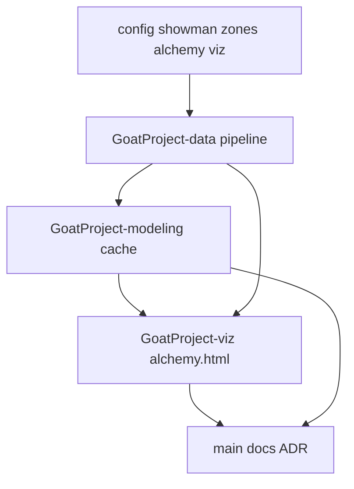

# Architecture Blueprint: Alchemy v2 (Showman + Shot Zones + Alchemy Lab)

**Stage:** 0 — Blueprint  
**Date:** 2026-06-21  
**Orchestrator:** Main Orchestrator (project-swarm)  
**Status:** Approved for RFC/DAG

## Demo path

```bash
cd GoatProject && ./run.sh
open GoatProject-viz/output/index.html   # link → Alchemy Lab
open GoatProject-viz/output/alchemy.html # pick A + B, α slider, PC-lerp or skip
```

**Success:** User blends two players, sees ghost-orb animation (or snap), nearest neighbor highlighted, math side panel explains α·u + (1−α)·v in R¹⁸. Core rankings unchanged.

## Layout note

GoatProject uses **git worktrees**, not a single `project/` folder:

| Worktree | Role |
|----------|------|
| `main` | Config, docs, `run.sh`, `plans/` |
| `GoatProject-data` | Ingestion, parquet, manifest |
| `GoatProject-modeling` | Rankings, alchemy cache |
| `GoatProject-viz` | Static HTML/PNG outputs |

Plans live in `plans/` on **main**. Implementation stays in assigned worktrees.

---

## Components (nouns → owners)

| Component | Owns | Must not know about |
|-----------|------|---------------------|
| `excitement.py` | Showman raw + z, partial flag | Three.js, cache JSON |
| `shooting_zones.py` | Zone shares + zone z-scores | Alchemy UI |
| `run_pipeline.py` | Manifest, parquet writes | Blend animation |
| `combine.py` | C(u,v), D(w), cache entries | HTML generation |
| `io.py` | Column lists from manifest | Viz theme |
| `alchemy_page.py` | Alchemy Lab HTML | CSV parsing |
| `scene_shared.py` | Three.js scene factory | Showman formula |
| `embed_3d.py` | Explorer only (no inline alchemy) | α slider logic |

---

## Layer boundaries

```
config/*.yaml
    ↓
GoatProject-data  →  processed/*.parquet + manifest.json
    ↓
GoatProject-modeling  →  rankings + alchemy_cache.json (R¹⁸)
    ↓
GoatProject-viz  →  embed_3d.html + alchemy.html + index.html
```

**Separation rule:** Ranking geometry uses `feature_columns` (11). Alchemy uses `alchemy_feature_columns` (18). Never mix without explicit manifest field.

---

## Vector space (R¹⁸)

**Core (11, unchanged):** `bpm_z` … `x3p_ar_z`

**Alchemy extensions (7):**
- `showman_z` — composite excitement score
- `zone_0_3_z`, `zone_3_10_z`, `zone_10_16_z`, `zone_16_3p_z`, `zone_3p_z`, `zone_corner3_z`

**Operators:**
- `C(u,v) = α·u + (1−α)·v` (α from UI slider, default 0.5)
- `D(w) = argmin_{p∈E} ‖w − p‖₂` in R¹⁸

**Display vs distance:** Orb positions = PCA projection of **11-dim core**. Alchemy NN distance = **18-dim L2**. UI must label both.

---

## Showman score (locked decisions)

| Mode | Weights |
|------|---------|
| Full data | dunk 30%, and1 25%, ASG 25%, MVP 15%, heave 5% |
| Legacy partial (`showman_partial=true`) | ASG 45%, MVP 25%, heave 5%; dunk/and1 excluded (reweight, no imputation) |

Partial flag surfaced in Alchemy Lab + math panel.

---

## Shot zones

- Source: `Player Shooting.csv` zone FGA shares
- Alchemy: 6 independent z-scores per zone
- Viz metadata: raw shares → half-court mini chart; post-blend renormalize raw shares for display only

---

## Alchemy Lab UI

| Element | Behavior |
|---------|----------|
| Player pickers | Searchable A/B (reuse picker pattern) |
| α slider | Updates blend; math side panel explains |
| Blend | PC-lerp ghost orb A→B (~800ms) |
| Skip animation | Checkbox → snap to NN highlight |
| Result panel | Discovery label, L2 in R¹⁸, zone charts, partial badge |
| Inline ⚗ | **Removed** from `embed_3d.html` (`alchemy_inline: false`) |

---

## Config files (new / updated)

| File | Purpose |
|------|---------|
| `config/showman.yaml` | Component weights (full vs legacy_partial) |
| `config/scoring_zones.yaml` | Zone column map, corner derivation |
| `config/alchemy.yaml` | v2.0.0, R¹⁸ disclaimer, α defaults |
| `config/viz.yaml` | `alchemy_inline: false`, alchemy page flags |

---

## Trade-offs (named)

| Decision | Benefit | Cost |
|----------|---------|------|
| Split feature_columns vs alchemy_feature_columns | Core rankings stable | Two column lists to maintain |
| R¹⁸ NN vs 11-dim PCA display | Richer alchemy | User confusion without dual labels |
| Full pair cache inline in HTML | No CORS, static hosting | Larger page payload |
| Reweight legacy showman | Fair to pre-1979 legends | Cross-era scores not directly comparable |
| Separate alchemy.html | Clear UX, no explorer clutter | Scene code must be shared/refactored |

---

## Dependency graph


