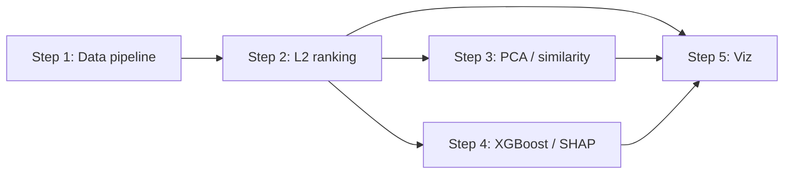

# Blueprint: NBA GOAT Ranking System (v1)

**Objective:** Finish the curated 21-player GOAT ranking system — data pipeline → L2 ranking → unsupervised analysis → XGBoost/SHAP validation → viz.

**Status:** Approved — Step 1 ready  
**Plan path:** `plans/goat-nba-ranking-system.md`  
**Architecture:** `ARCHITECTURE.md` (approved 2026-06-14)  
**Allowlist:** `config/allowlist.yaml`  
**Pipeline:** `config/pipeline.yaml`  
**Memory:** `MEMORY/MEMORY.md`  
**Mode:** Direct (local git + worktrees; no git remote)  
**Created:** 2026-06-14  
**Player pool:** 21 (locked for v1)

---

## Implementation gate

**Passed 2026-06-14.** Proceed with Step 1 on `GoatProject-data` / `data` branch.

---

## Plan audit (second pass)

**Overall validity: 78/100** — ready to build after one pipeline correction.

| Area | Status | Notes |
|------|--------|-------|
| Architecture | ✅ Solid | Embeddings → L2 rank → PCA/similarity → XGBoost as validator |
| Data on disk | ✅ Ready | Kaggle CSVs in `GoatProject-data/data/` |
| Worktree layout | ✅ Correct | data / modeling / viz branches |
| Player pool | ✅ Sufficient | 21 covers eras, positions, play styles |
| Execution steps | ✅ Clear | 5 steps with outputs defined |
| Era adjustment | ⚠️ **Fix required** | Z-scores must use **full league** baselines, not the 21-player subset |
| Playoffs | ✅ Correctly deferred | No player-level playoff columns |
| Tests / CI | ⚠️ Missing | Add pytest in Step 1; no remote CI yet |
| Module layout | ⚠️ Missing | Steps should create `src/` + `tests/` per worktree |

### Critical correction (Step 1)

**Wrong:** filter to 21 players → then z-score within season/position.  
**Right:** compute season/position z-scores using **all players in the CSV** → then filter to the 21-player pool → aggregate career vectors.

Without this, “era adjustment” becomes “elite peer comparison,” which compresses differences and breaks the stated design.

### Minor fixes before/during Step 1

- Apply pre-1979 / 3pt-feature flags to **both** Kareem and Moses Malone.
- Use `player_id` as join key; display names for labels only (Unicode-safe).
- Drop `Player Per Game.csv` from feature joins (metadata only).

---

## Should we add more players?

**Recommendation: No for v1. Keep 21.**

| Factor | More players (25–50) | Stay at 21 |
|--------|----------------------|------------|
| GOAT framing | Dilutes “all-time shortlist” intent | ✅ Matches project goal |
| L2 ranking stability | More crowded mid-tier | ✅ Clear elite tier |
| Era z-scores | **No benefit** if baselines use full league | ✅ Same quality |
| PCA on career vectors | 21 points is adequate for ~20 components max | ✅ Adequate |
| XGBoost (season rows) | More label rows from same 21 careers | Neutral |
| Viz / narrative | Harder to show on one leaderboard | ✅ Readable |
| Build time | More filter edge cases | ✅ Ship faster |

**When to expand (v2 only):** add a **robustness tier** of 4–6 borderline Hall-of-Famers as sensitivity analysis, not core rankers:

- Allen Iverson — tests volume-scorer vs advanced-stats rank divergence
- Dwyane Wade — guard peer to Harden/CP3
- John Stockton — assist/efficiency archetype
- Patrick Ewing — center era gap between Moses/Kareem and modern bigs

Do **not** expand to 30+ or full Hall of Fame — that shifts the project to league-wide ranking.

---

## Dependency graph



**Parallel after Step 2:** Steps 3 and 4 can run in parallel. Step 5 waits for 2–4.

---

## Invariants (every step)

- All 21 `player_id`s present in outputs when that step produces player-level data
- Rank reproducible: same inputs → same `goat_rankings.csv` order
- XGBoost never replaces L2 as primary rank (validation only)

---

## Step 1 — Data pipeline

**Worktree / branch:** `GoatProject-data` / `data`  
**Rollback:** delete `processed/` and revert commit on `data` branch

### Context brief

Build the foundation pipeline for 21 curated GOAT candidates. Raw CSVs in `GoatProject-data/data/`. Output to `GoatProject-data/processed/`. Era adjustment uses **full-league** season/position z-scores with fallback ladder (`config/pipeline.yaml`), then filters to the allowlist. Missing BPM/VORP seasons dropped per `missing_features` policy. Kareem and Moses Malone pre-1979 seasons get a `pre_three_point_line` flag.

**Config:** `config/pipeline.yaml`, `config/features.yaml`, `config/labels.yaml` (v1: Advanced.csv only; Per 100 deferred).

**Allowlist:** see `config/allowlist.yaml`.

### Tasks

1. Create `GoatProject-data/src/goat_data/` + `tests/`
2. `players.py` — allowlist with `player_id` from `Player Career Info.csv`
3. `load.py` — **Advanced.csv** + `Player Season Info.csv` only (Per 100 deferred v1)
4. `era_adjust.py` — z-score by `(season, position)` on full league with fallback ladder; then filter
5. `aggregate.py` — career vector = unweighted mean of season vectors
6. `labels.py` — build `season_labels.parquet` per `config/labels.yaml`
7. `covariance.py` — full-league career matrix → `league_career_covariance.npy` + correlation stats
8. `run_pipeline.py` → `processed/season_vectors.parquet`, `career_vectors.parquet`, `season_labels.parquet`, `manifest.json`

Manifest must include: `config_hashes`, `raw_csv_checksums`, era fallback counts, missing-data drop counts, `feature_correlation_max`, `covariance_condition_number`, `label_stats`.

### Verification

```bash
cd "GoatProject-data"
python3 -m pytest tests/ -q
python3 -m goat_data.run_pipeline
python3 -c "import json; m=json.load(open('processed/manifest.json')); assert m['player_count']==21; assert 'config_hashes' in m"
```

### Exit criteria

- [ ] `career_vectors.parquet` has 21 rows
- [ ] `season_labels.parquet` present with MVP + All-NBA columns
- [ ] `league_career_covariance.npy` present
- [ ] Manifest records hashes, fallback usage, missing-data drops
- [ ] pytest green (include: no allowlist-before-zscore, Kareem/Moses 3pt, BPM-missing seasons, σ=0 fallback)

---

## Step 2 — Dual-score ranking + publish gate

**Worktree:** `GoatProject-modeling` / `modeling`  
**Depends on:** Step 1

### Context brief

Load `../GoatProject-data/processed/career_vectors.parquet` and `league_career_covariance.npy`.
Compute L2, Mahalanobis, and PCA-whitened L2 scores per `config/scoring.yaml`.
Run sensitivity battery S1–S5 → `output/sensitivity_report.json`.
Set `public_headline_score` per publish gate (§8.2) → `output/goat_rankings.csv`.

### Exit criteria

- [ ] 21 players ranked; all three score columns populated
- [ ] `sensitivity_report.json` exists with `publish_gate_pass`
- [ ] Deterministic rerun

---

## Step 3 — PCA, similarity, hybrids

**Worktree:** `GoatProject-modeling`  
**Depends on:** Step 2 | **Parallel with:** Step 4

### Exit criteria

- [ ] `similarity_matrix.csv`, `pca_coordinates.csv`, `pca_explained_variance.json`, `pca_loadings.csv`, `uniqueness.csv` in `output/`

---

## Step 4 — XGBoost + SHAP validation

**Worktree:** `GoatProject-modeling`  
**Depends on:** Steps 1–2 | **Parallel with:** Step 3

### Exit criteria

- [ ] `validation_report.json` with test-season (≥2015) **primary** metrics: Spearman on `mvp_vote_share`, ROC-AUC (or accuracy) on `all_nba_first`
- [ ] Optional secondary career-level Spearman documented; primary rank and publish gate unchanged

---

## Step 5 — Visualization

**Worktree:** `GoatProject-viz` / `viz`  
**Depends on:** Steps 2–4

### Exit criteria

- [ ] `output/index.html` + `posts/` PNGs; headline chart uses `public_headline_score`
- [ ] No post assets without `sensitivity_report.json`

---

## Adversarial review

| Check | Result |
|-------|--------|
| Full-league z-scores specified | ✅ |
| 21-player cap justified | ✅ |
| XGBoost validation-only | ✅ |
| Dual-score + publish gate | ✅ |
| Sensitivity before social post | ✅ |
| MLE spec amendments (2026-06-14) | ✅ missing data, fallback groups, labels.yaml, PCA population, S5 block |

---

## Plan mutation log

| Date | Change |
|------|--------|
| 2026-06-14 | Initial blueprint; 21 players locked; full-league z-score fix |
| 2026-06-14 | MLE review amendments — pipeline missing-data/fallback, labels.yaml, scoring S5/PCA, validator §8.3, Step 1 labels+covariance |
