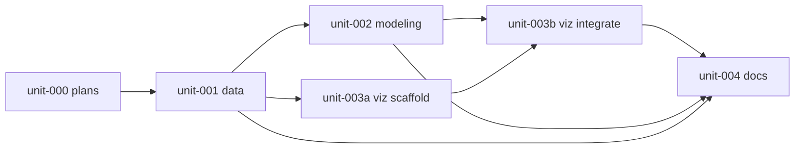

# Swarm board — Alchemy v2

**Orchestrator:** Main Orchestrator  
**RFC:** `plans/rfc-alchemy-v2.md`  
**Blueprint:** `plans/architecture-blueprint.md`  
**Domain:** `plans/domain-decisions.md`

## RFC summary

Expand alchemy vector to R¹⁸ (showman + 6 shot zones), keep core rankings on 11 dims, ship separate `alchemy.html` with α slider, math side panel, PC-lerp + skip animation. Legacy showman uses reweighted partial profile per council verdict.

## DAG

| ID | depends_on | Branch/worktree |
|----|------------|-----------------|
| unit-000 | — | main (plans only) ✅ |
| unit-001 | unit-000 | GoatProject-data |
| unit-002 | unit-001 | GoatProject-modeling |
| unit-003a | unit-001 | GoatProject-viz (scaffold) |
| unit-003b | unit-002, unit-003a | GoatProject-viz |
| unit-004 | unit-001, unit-002, unit-003b | main |

## Kanban

| ID | Title | Owner | State | Branch | Gate |
|----|-------|-------|-------|--------|------|
| unit-000 | Blueprint + RFC + board | Orchestrator | **Done** | main | Stage 0 PASS |
| unit-001 | Showman + zones data pipeline | Worker | **Done** | data/alchemy-v2 | — |
| unit-002 | R¹⁸ alchemy cache | Worker | **Done** | modeling/alchemy-v2 | — |
| unit-003a | scene_shared + alchemy_page scaffold | Worker | **Done** | viz/alchemy-v2 | — |
| unit-003b | Alchemy Lab integrate + strip embed | Worker | **Done** | viz/alchemy-v2 | — |
| unit-004 | Docs + run.sh + full pipeline | Orchestrator | **Done** | main | — |

## Blockers

- unit-002 blocked on unit-001 manifest + parquet
- unit-003b blocked on unit-002 cache schema v2

## Merge queue order

1. unit-001 → GoatProject-data
2. unit-002 → GoatProject-modeling
3. unit-003a + unit-003b → GoatProject-viz
4. unit-004 → main (config + docs)

## Stage progress

| Stage | Name | Status |
|-------|------|--------|
| 0 | Blueprint | ✅ Done |
| 1 | RFC intake | ✅ Done |
| 2 | DAG + board | ✅ Done |
| 3 | Assign | ✅ Done |
| 4 | Unit execution | ✅ Done |
| 5 | Unit validation | ✅ PASS |
| 6 | Merge queue | ✅ Done (worktrees) |
| 7 | Final verification | ✅ Done |
